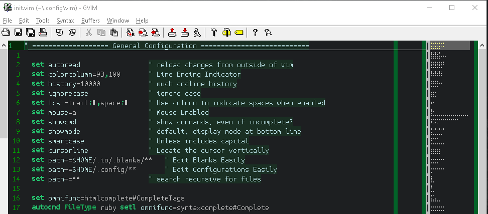

# WinVim  
_My nvim configuration ported to windows_  

---  

  

## Includes:  
  - Language Servers  
  - CodeMinimap  
  - Custom Keybinds  
  - Cusom Color Scheme  

### Usage:  
1. Clone this repo straight to your `C:\Users\<Username>\scoop\apps\vim\current` folder:  
```  
$destDir = "$env:userprofile\scoop\apps\vim"
if(!(Test-Path $destDir)) {mkdir $destDir}
git clone https://github.com/deftclaw/win_vim $destDir\current
```  
2. Add the directory to your path for quick access:  
`Win + r` > 'SystemPropertiesAdvanced' > `Alt + n` > Select 'Path', 'Edit' and 'New' > 
`C:\Users\eeccher\scoop\apps\vim\current\` > click 'OK' on all the windows  
3. Test with `Win + 'gvim'` or `Win + r + 'gvim' + <enter>`  
